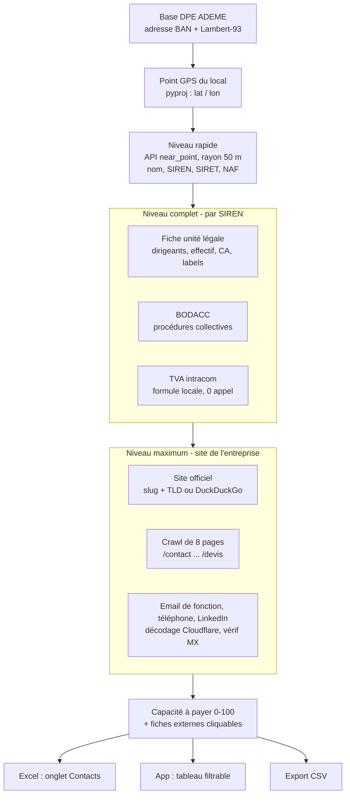

# 🔥 ThermoData

Générateur de plans de prospection pour artisans et bureaux d'études RGE, construit
sur les données DPE ouvertes de l'ADEME.

Une adresse de départ, un rayon, quelques filtres, et l'outil produit une tournée
optimisée avec un classeur Excel prêt à livrer : adresses certifiées, scoring
commercial, arguments chiffrés, obligations réglementaires détectées, entreprises
occupantes identifiées et navigation GPS. Sans aucune clé API ni abonnement.

Deux applications, un seul code.

| Application | Cible | Fichier d'entrée | URL |
|---|---|---|---|
| **ThermoData Logement** | porte-à-porte B2C sur les passoires E/F/G | `app.py` | thermodata.streamlit.app |
| **ThermoData Tertiaire** | prospection B2B sur les locaux professionnels | `app_pro.py` | thermodata-tertiaire.streamlit.app |

---

## Architecture

```
ThermoData-App/
├── app.py                    entrée Logement   (fixe TD_MODE=logement, exécute _ui.py)
├── app_pro.py                entrée Tertiaire  (fixe TD_MODE=pro,      exécute _ui.py)
├── _ui.py                    interface Streamlit partagée par les deux apps
├── thermodata_engine.py      moteur : chargement, scoring, tournée, Excel logement
├── entreprises.py            identification et enrichissement des occupants (tertiaire)
├── excel_commun.py           onglets communs aux deux classeurs + helpers de mise en page
├── excel_tertiaire.py        onglets spécifiques au classeur tertiaire
│
├── data/                     bases Parquet découpées par département
│   ├── res/dep=69.parquet    logements E/F/G
│   ├── ter/dep=69.parquet    locaux tertiaires (E/F/G + sans étiquette)
│   ├── aud/dep=69.parquet    audits énergétiques (logements)
│   └── manifest.json         inventaire : lignes, poids, date max par base
│
├── tools/
│   ├── sync_data.py          synchro quotidienne ADEME → Parquet (lancé par la CI)
│   ├── update_dpe.py         moteur de téléchargement : schéma API, filtres, curseur
│   ├── build_parquet.py      conversion des anciens CSV de Source/ vers data/
│   └── keepalive.py          maintien en éveil des deux apps
│
├── .github/workflows/
│   ├── update-dpe.yml        cron quotidien ~06h17 Paris → sync_data.py
│   ├── deploy-branch.yml     miroir main → branche deploy (sans les dossiers lourds)
│   └── keepalive.yml         toutes les 6 h : ping des apps + battement de cœur CI
│
├── .streamlit/config.toml    thème clair des deux apps
├── local-execution/          notebook de préparation manuelle des données
└── requirements.txt
```

**Pourquoi un seul `_ui.py`** : les deux points d'entrée fixent la variable
d'environnement `TD_MODE` puis exécutent le même fichier d'interface. Une seule
interface à maintenir, deux produits distincts.

**Pourquoi du Parquet par département** : Streamlit Cloud clone tout le repo au
démarrage avec environ 1 Go d'espace. Un fichier par département fait lire 1 à 4 Mo
à l'application au lieu de 500 Mo, et seuls les départements modifiés sont réécrits,
donc l'historique Git reste léger.

**Pourquoi une branche `deploy`** : le workflow `deploy-branch.yml` maintient un
miroir de `main` sans les dossiers lourds. Les deux apps Streamlit pointent sur
`deploy`, pas sur `main`.

---

## Installation

```bash
pip install -r requirements.txt
streamlit run app.py        # Logement
streamlit run app_pro.py    # Tertiaire
```

L'application s'ouvre sur `http://localhost:8501`.

Les bases sont versionnées dans `data/`, il n'y a donc rien à télécharger pour
démarrer. Le dossier peut être déplacé via la variable `TD_DATA`. Optionnel :
`pip install dnspython` active la vérification DNS des emails trouvés en niveau
Maximum ; sans lui, la colonne MX affiche simplement « non vérifié ».

### Reconstruire les données depuis zéro

```bash
python tools/sync_data.py                 # ADEME → data/*/dep=XX.parquet
python tools/build_parquet.py             # ou : anciens CSV de Source/ → data/
```

`sync_data.py` est incrémental : il ne récupère que les diagnostics établis depuis
la date maximale déjà présente localement, avec reprise sur curseur et budget de
temps pour rester dans les limites de GitHub Actions. Si une base est absente ou
ne respecte plus le contrat de colonnes attendu par le moteur, elle est reconstruite
entièrement.

---

## Le pipeline, étape par étape

1. **Géocodage** de l'adresse de départ via l'API Base Adresse Nationale (un appel)
2. **Sélection des départements** dont l'emprise est atteignable dans le rayon,
   déduite des données elles-mêmes et mise en cache : une tournée à Lyon voit le 38
   et le 01 sans table codée à la main
3. **Chargement** des Parquet concernés, colonnes utiles uniquement
4. **Filtrage** classe DPE, type de bien, énergie de chauffage, secteur d'activité
5. **Validation des adresses** sur les champs BAN natifs du DPE, sans un seul appel
   API par ligne
6. **Déduplication** : les DPE officiellement remplacés sont écartés, puis un seul
   diagnostic par adresse physique, le plus récent
7. **Conversion Lambert-93 → WGS84** via pyproj, puis filtre du rayon kilométrique
8. **Enrichissement** : densité de rue, profil de commune, croisement avec les audits
   énergétiques (logement), identification et enrichissement de l'entreprise
   occupante et pré-qualification réglementaire (tertiaire, voir section dédiée)
9. **Scoring commercial** sur 0 à 100 points
10. **Optimisation de tournée** : plus proche voisin puis 2-opt sur matrice de
    distances précalculée
11. **Export** : Excel 12 onglets en logement, 13 en tertiaire, plus un CSV
    (séparateur `;`, encodage utf-8-sig) pour import CRM ou Google Sheets

---

## Garantie qualité des adresses

Quadruple filtre sur les champs BAN présents nativement dans le fichier DPE :

| Critère | Valeur attendue |
|---|---|
| `statut_geocodage` | `adresse géocodée ban à l'adresse` |
| `numero_voie_ban` | non nul |
| `score_ban` | ≥ 0,60 (configurable) |
| `adresse_ban` | non nulle |

Conséquence : les adresses produites sont trouvées par Google Maps et Waze. Le prix
à payer est un volume plus faible que la base brute, ce qui est le bon compromis
pour du terrain.

---

## Scoring

### Logement

| Critère | Points |
|---|---|
| Base | 10 |
| Étiquette DPE (G le plus fort) | 0 à 20 |
| Coût de chauffage déclaré | 0 à 25 |
| Qualité d'isolation | 0 à 15 |
| Énergie fossile (fioul puis gaz) | 0 à 15 |
| Déperditions de l'enveloppe | 0 à 10 |
| Densité de la rue | 0 à 6 |
| **Audit énergétique récent** | **+25** |

Un audit récent signale une vente en cours ou un dossier d'aides actif : ces
adresses remontent naturellement en tête et sont isolées dans l'onglet 🔥 Chauds,
avec le coût des travaux et le gain annuel quand l'audit contient un scénario chiffré.

### Tertiaire

| Critère | Points |
|---|---|
| Base | 10 |
| Facture d'énergie déclarée | 0 à 35 |
| Étiquette DPE | 0 à 20 |
| Surface utile (seuil décret à 1 000 m²) | 0 à 15 |
| Consommation au m² | 0 à 8 |
| Densité de la rue | 0 à 6 |
| Obligations réglementaires détectées | 0 à 14 |

Un garde-fou plafonne les frais d'énergie aberrants saisis dans la base ADEME
au-delà de 300 €/m²/an. Environ la moitié des DPE tertiaires n'ont pas d'étiquette :
ces locaux sont conservés, le score bascule alors sur la facture et la surface.

**Paliers de priorité** : 🔥 CHAUD à partir de 70 · ⭐ Intéressant de 50 à 69 ·
📋 Standard de 30 à 49 · 🔹 Faible en dessous.

---

## Identification et enrichissement des entreprises (tertiaire)

Le fichier DPE de l'ADEME décrit un bâtiment, jamais son occupant. Le pont entre
les deux est géographique : les coordonnées Lambert-93 du DPE sont converties en
GPS, puis l'API Recherche d'entreprises est interrogée sur un rayon de 50 mètres
autour du point. L'établissement actif le plus proche est retenu comme occupant
probable, ce qui donne le SIREN, et le SIREN déverrouille tout le reste. Aucune
clé API, aucun abonnement : uniquement des données publiques et le site des
entreprises.



### Les trois niveaux

Réglés dans l'app tertiaire, cumulatifs. Durées mesurées avec la parallélisation
sur 8 à 12 fils.

| Niveau | Ce qu'il ajoute | Durée |
|---|---|---|
| ⚡ Rapide | nom, SIREN, SIRET, activité NAF, autres établissements à l'adresse | quasi instantané |
| 🎯 Complet (défaut) | dirigeant et fonction, autres dirigeants, effectif salarié, catégorie, forme juridique, ancienneté, CA, CA n-1, variation, résultat net, établissements ouverts, labels (RGE, Qualiopi, ESS...), convention collective, TVA intracommunautaire, annonces BODACC, capacité à payer | ~1 s pour 20 locaux |
| 🔎 Maximum | site officiel, email de fonction vérifié en DNS, téléphone, page LinkedIn, trouvés sur le site de chaque entreprise | ~1 s par local |

### Capacité à payer

Indicateur 0-100 calculé depuis le CA et sa tendance, l'effectif, la catégorie,
l'implantation, l'ancienneté et les signaux BODACC : 💎 Forte · ✅ Correcte ·
🔹 Limitée · ⚠️ Faible · 🚫 À écarter (procédure collective ou entreprise cessée).
Il sert à trier les rendez-vous, pas à noter financièrement une société : un local
énergivore occupé par une entreprise sans moyens ne devient pas un chantier.

### Robustesse et conformité

- Chaque appel API est retenté 3 fois avec attente progressive ; le code 429
  attend plus longtemps. Un timeout passager ne laisse pas un champ vide.
- Cache par SIREN et par coordonnées : dix locaux d'une même enseigne ne coûtent
  qu'un seul appel de fiche.
- Seuls les emails **de fonction** (contact@, info@, devis@...) publiés sur le site
  officiel sont retenus, avec décodage des adresses masquées (Cloudflare, écritures
  « [at] »). Aucun email nominatif n'est deviné : ce serait une donnée personnelle.
- L'identification est une **inférence géographique**, pas un lien juridique. Les
  cas ambigus sont signalés (colonne « Autres à l'adresse »), les locaux sans
  correspondance restent sans nom, et l'onglet Contacts affiche son taux de
  couverture réel en tête plutôt que de prétendre à 100 %.

---

## Les classeurs Excel

Chaque génération produit un classeur Excel et sa version CSV (bouton dédié dans
l'app, séparateur `;`, encodage utf-8-sig : import direct dans Excel français, un
CRM ou Google Sheets, colonnes d'enrichissement incluses).

### Logement - 12 onglets

| Onglet | Contenu |
|---|---|
| Prospection | liste triée par score, couleurs DPE, liens Maps et Waze par adresse |
| 🔥 Chauds | adresses avec audit récent, travaux chiffrés et gain annuel |
| Dashboard | KPI de la tournée |
| Analyses | répartitions DPE, énergie, isolation, statistiques clés |
| Rues | regroupement par voie, lien Maps sur chaque rue |
| Feuille de route | tournée découpée en segments de 9 arrêts navigables |
| CRM & suivi | listes déroulantes, liens Maps et Waze par ligne, entonnoir et prévision de CA en formules |
| Simulateur ROI | cellules éditables, MaPrimeRénov', CEE, reste à charge, TRI, argument à bascule automatique |
| Guide | lecture de la liste, scripts de vente, aides |
| Aides & financement | MaPrimeRénov', CEE, éco-PTZ, TVA 5,5 %, aides locales |
| Calendrier réglo | échéances 2023 → 2034 |
| Lexique | méthode de scoring, calcul des économies, sources et limites |

### Tertiaire - 13 onglets

| Onglet | Contenu |
|---|---|
| Prospection B2B | liste scorée, badges réglementaires, facture réelle, liens GPS |
| ⚖️ Priorités réglo | locaux sous obligation, compte à rebours, objectif -40 % chiffré |
| Dashboard | KPI de la tournée |
| Analyses | croisements secteur, énergie, surface, période, étiquette, obligation |
| Contacts | occupant enrichi : adresse et Maps/Waze du local, dirigeants, effectif, finances, TVA, BODACC et lien vers les annonces légales, capacité à payer, en-têtes groupés sur deux niveaux |
| Zones | regroupement par rue, lien Maps sur chaque rue |
| Feuille de route | tournée découpée en segments de 9 arrêts navigables |
| CRM & suivi | listes déroulantes, liens Maps et Waze par ligne, entonnoir et prévision de CA en formules |
| Simulateur ROI | cellules éditables, CEE, reste à charge, TRI, argument à bascule automatique |
| Guide terrain | scripts par secteur, interlocuteurs, objections |
| Aides & financement | CEE 6e période, Coup de pouce tertiaire, ADEME, PRO-SMEn |
| Calendrier réglo | échéances 2024 → 2050 |
| Lexique & sources | méthode des badges et ses limites, qualité des données, sources |

Les onglets Feuille de route, CRM, Simulateur ROI, Aides et Calendrier viennent de
`excel_commun.py` et sont déclinés par mode : même mise en forme, contenus adaptés
au B2C ou au B2B.

---

## Pré-qualification réglementaire (tertiaire)

Quatre badges calculés depuis le DPE, avec leur niveau de fiabilité assumé et
documenté dans l'onglet Lexique du classeur.

| Badge | Règle | Fiabilité |
|---|---|---|
| ⚖️ Décret tertiaire | surface utile ≥ 1 000 m² | solide, mais le seuil s'apprécie au niveau du site : le fichier peut sous-estimer |
| 🤖 GTB / BACS | surface × 0,075 kW/m² comparée aux seuils de 70 et 290 kW | estimation, le DPE ne contient pas la puissance installée |
| 🎯 Audit DDADUE | surface × kWhEP/m²/an ≥ 2,75 GWh | indicateur seulement : le seuil légal porte sur l'énergie finale au niveau du SIREN |
| ⏳ DPE à renouveler | date du DPE + 10 ans, alerte à 18 mois | solide |

Ces badges servent à prioriser une tournée, pas à établir une position juridique.
Sur le terrain, ils se formulent en question, jamais en affirmation.

---

## Point de vigilance : la réforme du DPE de 2026

Depuis le 1er janvier 2026, le coefficient de conversion de l'électricité en énergie
primaire est passé de 2,3 à 1,9 (arrêté du 13 août 2025). Environ 850 000 logements
sont sortis du statut de passoire **sans aucun travaux**.

Conséquence directe pour la prospection : une étiquette F ou G issue d'un DPE
antérieur à cette date peut être obsolète si le logement est chauffé à l'électricité.
Le classeur signale ces lignes dans une colonne dédiée. Le propriétaire peut
télécharger gratuitement sa nouvelle étiquette sur l'Observatoire DPE-Audit de
l'ADEME, sans nouvelle visite de diagnostiqueur.

---

## Automatisations

| Workflow | Déclenchement | Rôle |
|---|---|---|
| `update-dpe.yml` | cron quotidien, ~06h17 Paris | synchro incrémentale des 3 bases, commit des Parquet modifiés |
| `deploy-branch.yml` | à chaque push sur `main` | reconstruit la branche `deploy` sans les dossiers lourds |
| `keepalive.yml` | toutes les 6 h | ping des deux apps (Streamlit met en veille au bout de 12 h sans trafic) et battement de cœur anti-désactivation des crons |

---

## Configuration d'une génération

L'objet `Config` de `thermodata_engine.py` :

| Champ | Défaut | Rôle |
|---|---|---|
| `adresse_label`, `lat`, `lon`, `dept` | - | point de départ géocodé |
| `classes_dpe` | `["F","G"]` | étiquettes retenues |
| `energies` | `[]` | filtre sur l'énergie de chauffage |
| `type_logement` | `"maison"` | `maison`, `appartement` ou `tous` |
| `nombre_portes` | `50` | taille de la tournée |
| `rayon_km` | `30.0` | rayon de recherche |
| `perimetre` | `"les_deux"` | `les_deux`, `dpe` seul ou `audit` seul |
| `risques_sol` | `False` | interroge Géorisques (radon, argiles) |
| `secteurs` | `None` | tertiaire : motifs de secteurs d'activité |
| `inclure_sans_etiquette` | `True` | tertiaire : garder les locaux sans étiquette |
| `identifier_entreprises` | `True` | tertiaire : identification de l'occupant |
| `niveau_entreprises` | `"complet"` | tertiaire : `rapide`, `complet` ou `maximum` |

Points d'entrée : `run(cfg, source)` en logement, `run_tertiaire(cfg, source)` en
tertiaire, `run_mixte(cfg, source_res, source_ter)` pour une tournée combinée.

---

## Sources

| Élément | Source |
|---|---|
| Données DPE et audits | ADEME - data.ademe.fr, licence Ouverte Etalab v2.0 |
| Adresses et géocodage | Base Adresse Nationale - adresse.data.gouv.fr |
| Coordonnées | Lambert-93 (EPSG:2154) → WGS84 via pyproj |
| Entreprises occupantes | API Recherche d'entreprises - recherche-entreprises.api.gouv.fr, sans clé |
| Annonces légales | BODACC - bodacc-datadila.opendatasoft.com, et pages annonces d'annuaire-entreprises.data.gouv.fr |
| Sites et contacts | site officiel de chaque entreprise, repli DuckDuckGo |
| Risques du sol | Géorisques - georisques.gouv.fr |
| Réglementation logement | Loi Climat et Résilience du 22 août 2021, arrêté du 13 août 2025 |
| Réglementation tertiaire | Décret n°2019-771 (DEET), décret n°2020-887 (BACS), loi DDADUE n°2025-391 |
| Aides | Anah, arrêté du 6 septembre 2025 (75e arrêté CEE), décret 2025-956 |

État réglementaire des classeurs arrêté au 4 août 2026.

---

## Limites connues

- **Adresses des DOM** : le code département est tronqué à deux caractères, donc
  « 971 » devient « 97 », qui ne correspond à aucune donnée. Les cinq DOM ne
  ressortent pas. La Corse (2A, 2B) fonctionne.
- **Lien de tournée complète** du Dashboard : Google Maps plafonne un itinéraire à
  environ dix points, ce lien n'est donc utilisable que sur les petites tournées.
  L'onglet Feuille de route existe précisément pour ça et découpe la tournée en
  segments de neuf arrêts.
- **Identification des occupants** : c'est une inférence par géolocalisation. Un
  local vide, en travaux, ou occupé par une entité immatriculée ailleurs reste sans
  nom, et un immeuble multi-entreprises peut renvoyer un voisin. Le taux de
  couverture réel est affiché en tête de l'onglet Contacts. Les emails nominatifs
  et les mobiles directs n'existent pas en open data : seul le scraping du site
  officiel fournit un email de fonction, sur environ 6 entreprises sur 10.
- **Énergie de chauffage en tertiaire** : renseignée sur une faible part des DPE.
  Filtrer sur ce champ réduit fortement le volume.
- **Facture d'énergie à zéro** : signifie « non déclarée au DPE », pas « pas de
  consommation ».

---

## Mentions

Réutilisation de données publiques sous licence Ouverte Etalab v2.0. Les classeurs
produits sont des supports de prospection : ils ne constituent ni un diagnostic, ni
un audit, ni un avis juridique sur l'assujettissement d'un bâtiment à une obligation.

En prospection B2B, les personnes morales relèvent du régime d'opposition. Les
entrepreneurs individuels et micro-entrepreneurs, dont l'adresse professionnelle
peut être le domicile, relèvent du consentement préalable. Seuls des emails de
fonction publiés par les entreprises elles-mêmes sont collectés, jamais d'emails
nominatifs.
